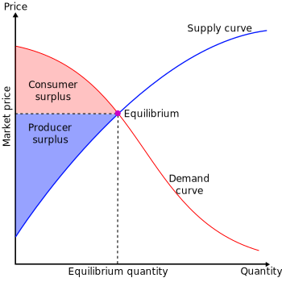

# 关于消费者剩余的刻画
> 有时需要刻画一些新策略对消费者剩余 (consumer-surplus, CS) 的影响，如产品的绿色程度、相应企业的社会责任等。传统经济学中关于 CS 的刻画主要是产品价格。
 

## 关于消费者剩余的刻画
假设消费者数量为 \(n\)。消费者的效用为 \(u_i = w_i - \alpha p + \beta e\)，其中 \(p\) 为价格，\(e\) 为商品的绿色度，且 \(w_i \sim U[0, w_H]\)。对于消费者 \(i\) 而言，当 \(u_i > 0\) 时，会购买。即 \(w_i > \alpha p - \beta e\)，那么需求函数为 
\[
q = n \int_{\alpha p - \beta e}^{w_H} f(w) dw = n \frac{w_H - \alpha p - \beta e}{w_H}.
\]
转换为 
\[
p = \frac{w_H}{\alpha} - \frac{w_H}{n\alpha} q + \frac{\beta}{\alpha} e,
\]
将上述系数 \(\{\frac{w_H}{\alpha}, -\frac{w_H}{n\alpha}, \frac{\beta}{\alpha}\}\) 改写为 \(\{a, -b, c\}\)，即
\[
\frac{w_H}{\alpha} = a, \quad -\frac{w_H}{n\alpha} = -b, \quad \frac{\beta}{\alpha} = c,
\]
则 
\[
p = a - bq + c(e + \mu).
\]
消费者剩余为
\[
CS = \int_0^{w_H} \max\{u_i, 0\} f(w) dw = \int_{\alpha p - \beta e}^{w_H} (w - \alpha p + \beta e) f(w) dw,
\]
计算得
\[
CS = \frac{(w_H - \alpha p - \beta e)(w_H - \alpha p + 3\beta e)}{2w_H}.
\]
进一步变换为
\[
CS = \frac{\left(\frac{w_H}{\alpha} - p - \frac{\beta e}{\alpha}\right)\left(\frac{w_H}{\alpha} - p + \frac{3\beta e}{\alpha}\right)}{\frac{2w_H}{\alpha}} = \frac{(a - p - ce)(a - p + 3ce)}{2a}.
\]
